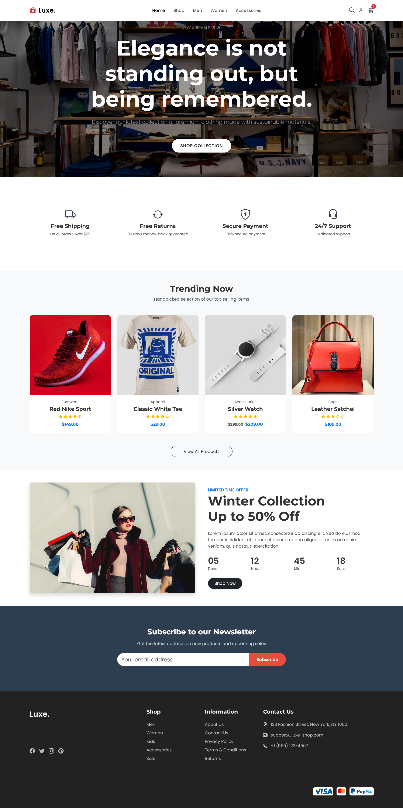

# Luxe - Modern E-Commerce Landing Page

A premium, responsive landing page template designed for fashion and lifestyle e-commerce brands. Built with HTML5 and Bootstrap 5, this project focuses on clean aesthetics, modern typography, and smooth user interactions.

## 📸 Screenshot


## 🚀 Features

-   **Fully Responsive Design**: Looks great on mobile, tablet, and desktop devices.
-   **Modern UI/UX**: Clean layout with whitespace, subtle shadows, and a professional color palette.
-   **Interactive Hero Section**: Full-width background with gradient overlay and call-to-action.
-   **Advanced Product Cards**: Custom hover effects featuring image zoom and quick-action buttons (Cart, View, Wishlist).
-   **Service Highlights**: Icon grid for value propositions (Free Shipping, Returns, etc.).
-   **Promotional Section**: Layout for "Deal of the Week" with a countdown timer design.
-   **Newsletter Signup**: Integrated subscription form design.
-   **Rich Footer**: Complete with navigation links, social media icons, and payment badges.

## 🛠️ Technologies Used

-   **HTML5**: Semantic markup.
-   **CSS3**: Custom properties (variables), flexbox, grid, and animations.
-   **Bootstrap 5.3**: Used for the grid system, responsive utilities, navigation, and components.
-   **Bootstrap Icons**: For UI icons throughout the page.
-   **Google Fonts**:
    -   *Montserrat* (Headings)
    -   *Poppins* (Body)

## 🔧 Setup & Usage

1.  **Clone the repository**:
    ```bash
    git clone https://github.com/yourusername/luxe-ecommerce.git
    ```
2.  **Open the file**:
    Simply double-click `landing.html` to open it in your default web browser. No local server or build process is required as all dependencies (Bootstrap, Fonts) are loaded via CDN.

## 🎨 Customization

You can easily customize the color scheme by modifying the CSS variables in the `<style>` section of `landing.html`:

```css
:root {
    --primary-color: #2c3e50; /* Change for main theme color */
    --secondary-color: #e74c3c; /* Change for accents/buttons */
}
